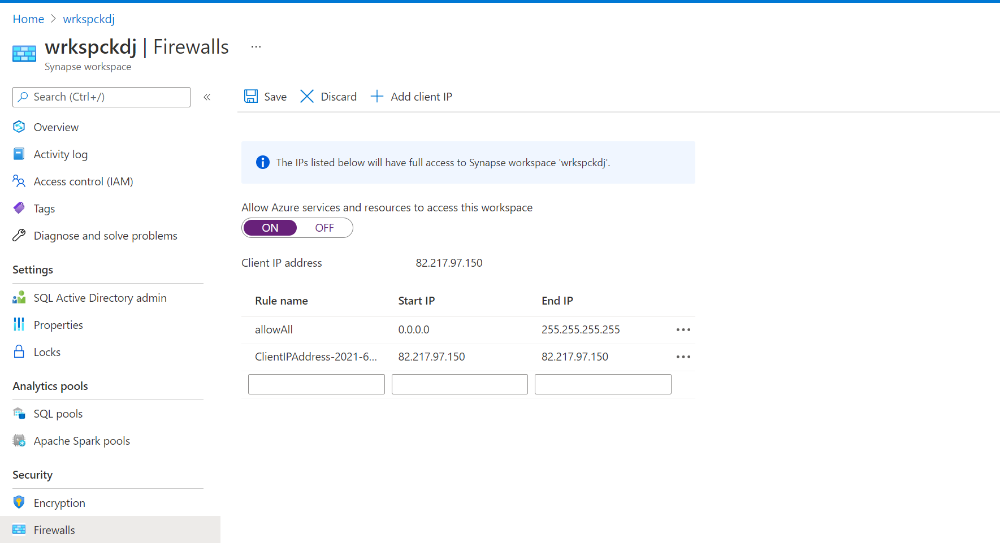

## Exercise Azure Synapse Analytics: Dedicated SQL Pool
  
Estimated Time: 15 minutes

Individual exercise
  
The main tasks for this exercise are as follows:

1. Create and configure a Azure Synapse Analytics instance.

2. Configure the Server Firewall

3. Pause the warehouse database

### Task 1: Create and configure a Azure Synapse Analytics instance.

1. In the Azure portal, click on the link **home** at the top left of the screen.

2. In the Azure portal, click **+ Create a resource**.

3. In the New blade, navigate to the **Search services and marketplace** text box, and type the word **Synapse**. Click **Azure Synapse Analytics** in the list that appears.

4. In the **Azure Synapse Analytics** blade, click **Create**.

5. From the **Create Synapse workspace** **basics** blade, create an Azure Synapse Analytics Workspace with the following settings:

    - In the Project details section, type in the following information

        - **Subscription**: the name of the subscription you are using in this lab

        - **Resource group**: **awrgstudxx**, where **xx** are your initials.

    - In the workspace details section, create the workspace with the following settings:
        
        - **Workspace Name**: **wrkspcxx**, where **xx** are your initials.
        - **Region**: choose the region nearest to you and where you deployed your resource group
        - **Select Data Lake Storage Gen2**: "from subscription"
        - **Account Name**: select **awdlsstudxx**, where **xx** are your initials
        - **File System Name**: select **data**
        - **Check** the "Assign myself the Storage Blob Data Contributor role on the Data Lake Storage Gen2 account 'awdlsstudxx" 

         

    - Navigate to the **Security** tab in the **Create Synapse workspace** blade. 

    - Under the SQL administrator credentials section provide the following:
        - **Password**: **Pa55w.rd**
        - **Confirm Password**: **Pa55w.rd**
        - Leave all the other settings as **default**. 

    - In the screen, click **Review + create**.
    - In the blade, click **Create**.

   > **Note**: The provision will takes approximately 7 minutes.

6. Once provisioned select **Go to resource**, and you'll be landing in the **Overview** page of your Azure Synapse Analytics workspace.  

7. Select **+ New dedicated SQL Pool**.

8. In the **basics** page of **Create dedicated SQL pool** blade configure the following settings:
- Dedicated SQL pool name: **dedsqlxx**, where **xx** are your initials
- Set the performance of the **dedsqlxx** to **DW100c**
- Leave all the other settings per default

9. In the **Create dedicated SQL pool** screen, click **Review + create**.

10. In the **Create dedicated SQL pool** blade, click **Create**.
  

   > **Note**: The provision will takes approximately 7 minutes.

### Task 2: Configure the Server Firewall

1. In the Azure portal, in the blade, click **Resource groups**, and then click **awrgstudxx**, and then click on **wrkspcxx**, where **xx** are your initials

2. In the **wrkspcxx** screen, click on **Networking**.

3. In the **wrkspcxx**- Firewalls  screen, click on the option **+ Add client IP**, and select/check that **Allow Azure services and resources to access this workspace** is set to **On**, and then click on **Save**. On the success screen click **OK**.

    

    > **Note**: You will receive a message stating that the the server firewall rules have been successfully updated

4. Close down the Firewalls screen.

> **Result**: After you completed this exercise, you have created an Azure  Synapse Analytics  instance and configures the server firewall to enable connections against it.

### Task 3: Pause the **dedsqlxx** dedicated SQL Pool

1. Navigate to **dedsqlxx** resource in your resource group. 

2. Click on **dedsqlxx**, where **xx** are your initials.

3. In the **dedsqlkxx (wrkspcxx/dedsqlxx)** screen, click on **Pause**.

4. In the Pause **dedsqlxx** screen, click **Yes**
