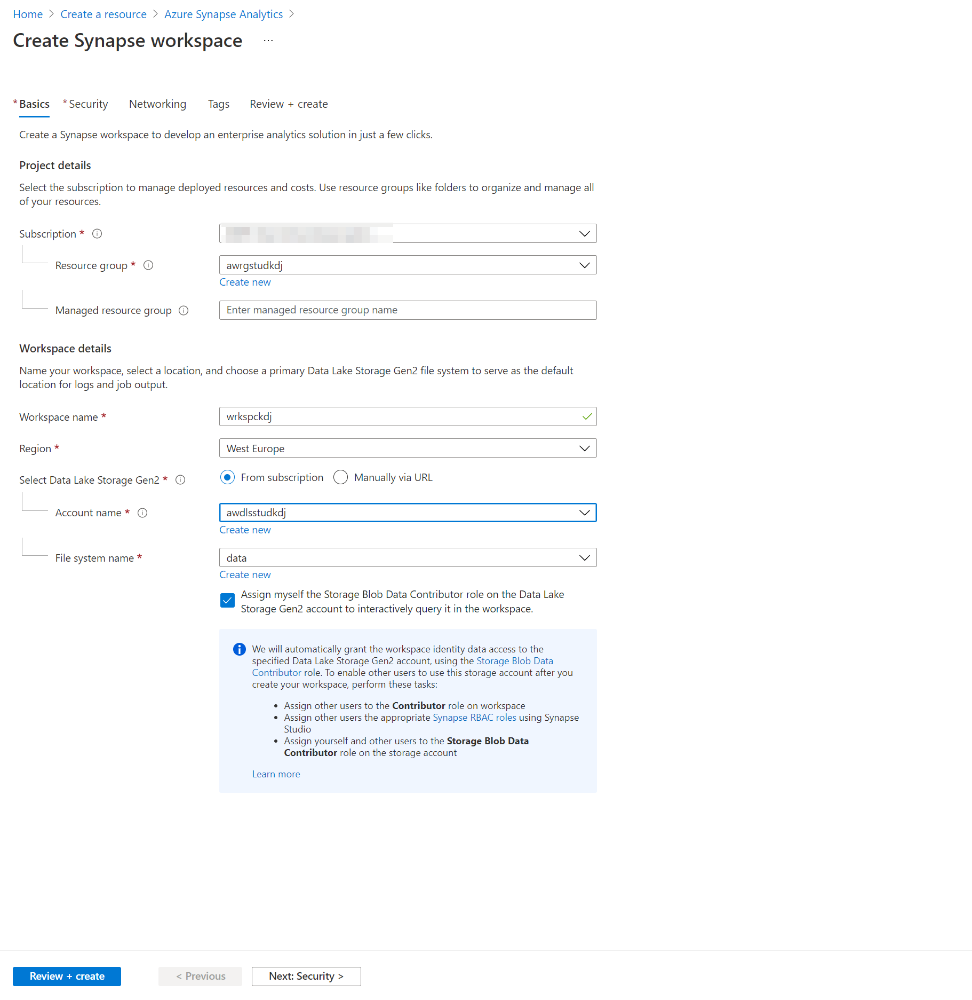
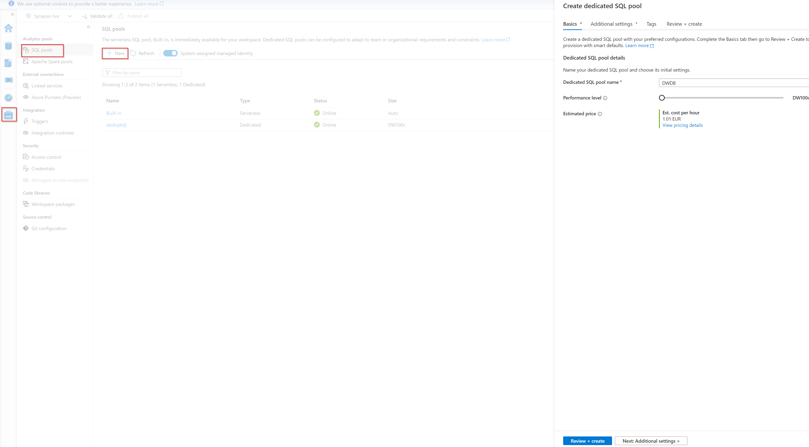

# Implementing a Data Platform Solution
# Lab - Working with Azure Synapse Dedicated SQL Pool

**Estimated Time**: 45 minutes

## Lab overview

The students will be able to provision an Azure SQL Database and Azure Synapse Analytics server and be able to issue queries against one of the instances that are created. They will be also be able to integrate a data warehouse with a number of other data platform technologies and use PolyBase to load data from one data source into Azure Synapse Analytics.

## Lab objectives
  
After completing this lab, you will be able to:

1. Describe Azure Synapse Analytics 
2. Create and query Azure Synapse Analytics 
3. Use PolyBase to load data into Azure Synapse Analytics 

## Scenario
  
You are the senior data engineer at AdventureWorks, and you are working with your team to  provision Azure Synapse Analytics server and test that the provisioning of the server is successful by testing a sample database with a series of queries. You will then use PolyBase to load a dimension table from Azure Blob to test that the integration of this data platform technology with Azure Synapse Analytics.

At the end of this lab, you will have:

1. Described Azure Synapse Analytics 
2. Created and queried Azure Synapse Analytics 
3. Used PolyBase to load data into Azure Synapse Analytics 

## Exercise 1: Describe Azure Synapse Analytics
  
Estimated Time: 15 minutes

Individual exercise
  
The main tasks for this exercise are as follows:

1. Create and configure a Azure Synapse Analytics instance.

2. Configure the Server Firewall

3. Pause the warehouse database

### Task 1: Create and configure a Azure Synapse Analytics instance.

1. In the Azure portal, click on the link **home** at the top left of the screen.

2. In the Azure portal, click **+ Create a resource**.

3. In the New blade, navigate to the **Search services and marketplace** text box, and type the word **Synapse**. Click **Azure Synapse Analytics** in the list that appears.

4. In the **Azure Synapse Analytics** blade, click **Create**.

5. From the **Create Synapse workspace** **basics** blade, create an Azure Synapse Analytics Workspace with the following settings:

    - In the Project details section, type in the following information

        - **Subscription**: the name of the subscription you are using in this lab

        - **Resource group**: **awrgstudxx**, where **xx** are your initials.

    - In the workspace details section, create the workspace with the following settings:
        
        - **Workspace Name**: **wrkspcxx**, where **xx** are your initials.
        - **Region**: EastUS
        - **Select Data Lake Storage Gen2**: "From subscription"
        - **Account Name**: create new as **awdlsstudxx**, where **xx** are your initials
        - **File System Name**: create new named **data**
        - **Check** the "Assign myself the Storage Blob Data Contributor role on the Data Lake Storage Gen2 account 'awdlsstudxx" 

         

    - Navigate to the **Security** tab in the **Create Synapse workspace** blade. 

    - Under the SQL administrator credentials section provide the following:
        - **Password**: **Pa55w.rd**
        - **Confirm Password**: **Pa55w.rd**
        - Leave all the other settings as **default**. 

    - In the screen, click **Review + create**.
    - In the blade, click **Create**.

   > **Note**: The provision will takes approximately 7 minutes.

6. Once provisioned select **Go to resource**, and you'll be landing in the **Overview** page of your Azure Synapse Analytics workspace.  

## Exercise 2: Creating an Azure Synapse Analytics database and tables

Estimated Time: 25 minutes

Individual exercise

The main tasks for this exercise are as follows: (Detailed steps are under Task 1)

1. Understand Synapse Studio and connect to a dedicated SQL Pool.

2. Create a dedicated SQL Pool database

3. Create dedicated SQL Pool tables

### Task 1: Connect the Dedicated SQL Pool to Azure Synapse Studio

1. Go to your Azure Synapse Workspace in Resource Group. 

2. In the **overview** section of the Synapse Workspace navigate to **Open Synapse Studio**

3. Click on the **Manage** on the left side of the screen

4. Select **SQL pool** and select **+ New**

    - In the Basics details section, type in the following information

        - **Dedicated SQL pool name**: **DWDB**
        - **Slide** the performance level from **DWxxxc** to **DW100c**

    - Leave all the other settings as default

    - Select **Review + Create** and select **Create**

    

 > **Note**: The creation of the database takes approximately 5-6 minutes.

5. Once the database is set up, navigate to the **Data** on the left side of the screen. Select the ellipsis next to **Databases** and select **refresh**. You should see the the newly created database DWDB. 


### Task 3: Create dedicated SQL Pool tables.

1. In Synapse Studio, navigate to the newly created database under **Databases** in the **Data**, when opening the ellipsis in the **Data** tab. Click on **DWDB(SQL)** and click on the 3 dots next to it.

2. Select **New SQL script**, and **empty script**

    >**Note**: Syntax to create the tables is [here](https://github.com/azuredevops619/MicrosoftLearning-DP-200-Implementing-an-Azure-Data-Solution-/blob/master/Labfiles/Starter/DP-200.5/SQL%20DW%20Files/Lab%205.3.3.%20Creating%20Tables/1_Creating%20Tables.sql)

3. Create a table named **dbo.Users** with a **clustered columnstore** index with a distribution of **replicate** with the following columns:

    | column name | data type | Nullability|
    |-------------|-----------|------------|
    | userId | int | NULL|
    | City | nvarchar(100) | NULL|
    | Region | nvarchar(100) | NULL|
    | Country | nvarchar(100) | NULL|

      >**Note**: Make sure that the script has is connected to **DWDB** and uses the database **DWDB**. 

4. In **Synapse Studio**, click on **Run** and the query will be executed. To verify if the **dbo.Users** table was created you can click refresh and navigate to **tables** which, when expanded, should show you the table. 

5. In Synapse Studio, navigate to the newly created database under **Databases** , when opening the ellipsis in the **Data hub** tab. Click on **DWDB**.

6. Select the ellipsis next to the **DWDB** database.

7. Select **New SQL script**, and **empty script**

8. Create a table named **dbo.Products** with a **clustered columnstore** index with a distribution of **round robin** with the following columns:

    | column name | data type | Nullability|
    |-------------|-----------|------------|
    | ProductId | int | NULL|
    | EnglishProductName | nvarchar(100) | NULL|
    | Color | nvarchar(100) | NULL|
    | StandardCost | int | NULL|
    | ListPrice | int | NULL|
    | Size | nvarchar(100) | NULL|
    | Weight | int | NULL|
    | DaysToManufacture | int | NULL|
    | Class | nvarchar(100) | NULL|
    | Style | nvarchar(100) | NULL|

    >**Note**: Make sure that the script has is connected to **DWDB** and uses the database **DWDB**. 

9. In **Synapse Studio**, click on **Run** and the query will be executed. To verify if the **dbo.Products** table was created you can click refresh and navigate to **tables** which, when expanded, should show you the table. 

10. In Synapse Studio, navigate to the newly created database under **Databases** , when opening the ellipsis in the **Data hub** tab. Click on **DWDB**.

11. Select the ellipsis next to the **DWDB** database.

12. Select **New SQL script**, and **empty script**

13. Create a table named **dbo.FactSales** with a **clustered columnstore** index with a distribution of **Hash** on the **SalesUnit** with the following columns:

    | column name | data type | Nullability|
    |-------------|-----------|------------|
    | DateId | int | NULL|
    | ProductId | int | NULL|
    | UserId | int | NULL|
    | UserPreferenceId | int | NULL|
    | SalesUnit | int | NULL|

    >**Note**: Make sure that the script has is connected to **DWDB** and uses the database **DWDB**. 

14. In **Synapse Studio**, click on **Run** and the query will be executed. To verify if the **dbo.FactSales** table was created you can click refresh and navigate to **tables** which, when expanded, should show you the table. 

> **Result**: After you completed this exercise, you have used Synapse Studio to create a data warehouse named DWDB and three tables named Users, Products and FactSales.


## Exercise 4: Using PolyBase to Load Data into Azure Synapse Analytics 

Estimated Time: 10 minutes

Individual exercise

The main tasks for this exercise are as follows:

1. Collect Data Lake Storage container and key details

2. Create a dbo.Dates table using PolyBase from Azure Data Lake Storage

### Task 1: Collect Azure Blob account name and key details

1. In the Azure portal, click on **Resource groups** and then click on **awrgstudxx**, and then click on **awdlsstudxx** where xx are the initials of your name.

2. In the **awdlsstudxx** screen, click **Access keys**. Click on the icon next to the **Storage account name** and paste it into Notepad.

3. In the **awdlsstudxx - Access keys** screen, under **key1**, Click on the icon next to the **Key** and paste it into Notepad.

### Task 2: Create a dbo.Dates table using PolyBase from Azure Blob

1. In Synapse Studio, navigate to the newly created database under **Databases** , when opening the ellipsis in the **Data ** tab. Click on **DWDB**.

2. Select the ellipsis next to the **DWDB** database.

3. Select **New SQL script**, and **empty script**

4. Create a **master key** against the **DWDB** database. In the query editor, type in the following code:

    ```SQL
    CREATE MASTER KEY;
    ```
    >**Note**: Make sure that the script has is connected to **DWDB** and uses the database **DWDB**. 

5. In **Synapse Studio**, click on **Run** and the query will be executed.

6. In Synapse Studio, navigate to the newly created database under **Databases** , when opening the ellipsis in the **Data hub** tab. Click on **DWDB**.

7. Select the ellipsis next to the **DWDB** database.

8. Select **New SQL script**, and **empty script**

9. Create a database scoped credential named **AzureStorageCredential** with the following details, by typing in the following code in the query editor: You have to put data lake key that you copied earlier in **SECRET** section.  
    - IDENTITY: **MOCID**
    - SECRET: **The access key of your storage account**

    ```SQL
    CREATE DATABASE SCOPED CREDENTIAL AzureStorageCredential
    WITH
    IDENTITY = 'MOCID',
    SECRET = 'Your storage account key'
;
    ```
    >**Note**: Make sure that the script has is connected to **DWDB** and uses the database **DWDB**. 

10. In **Synapse Studio**, click on **Run** and the query will be executed.

11. In Synapse Studio, navigate to the newly created database under **Databases** , when opening the ellipsis in the **Data hub** tab. Click on **DWDB**.

12. Select the ellipsis next to the **DWDB** database.

13. Select **New SQL script**, and **empty script**

14. In the Query window, type in code that will create an external data source named **AzureStorage** for the Blob storage account and data container created in with a type of **HADOOP** that makes use of the ****AzureStorageCredential**. Note that you should replace **awdlsstudxx** in the location key with your storage account name.

    ```SQL
	CREATE EXTERNAL DATA SOURCE AzureStorage
    WITH (
        TYPE = HADOOP,
        LOCATION = 'abfs://data@awdlsstudxx.dfs.core.windows.net',
        CREDENTIAL = AzureStorageCredential
    );
    ```
    >**Note**: Make sure that the script has is connected to **DWDB** and uses the database **DWDB**. 

15. In **Synapse Studio**, click on **Run** and the query will be executed.

16. In Synapse Studio, navigate to the newly created database under **Databases** , when opening the ellipsis in the **Data hub** tab. Click on **DWDB**.

17. Select the ellipsis next to the **DWDB** database.

18. Select **New SQL script**, and **empty script**

19. In the Query window, type in code that will create an external file format named **TextFile** with a formattype of **DelimitedText** and a filed terminator of **comma**.

    ```SQL
    CREATE EXTERNAL FILE FORMAT TextFile
    WITH (
        FORMAT_TYPE = DelimitedText,
        FORMAT_OPTIONS (FIELD_TERMINATOR = ',')
    );
    ```
    >**Note**: Make sure that the script has is connected to **DWDB** and uses the database **DWDB**. 

20. In **Synapse Studio**, click on **Run** and the query will be executed.

21. . In Synapse Studio, navigate to the newly created database under **Databases** , when opening the ellipsis in the **Data hub** tab. Click on **DWDB**.

22. Select the ellipsis next to the **DWDB** database.

23. Select **New SQL script**, and **empty script**   

24. In  the Query window, type in code that will create an external table named **dbo.DimDate2External** with the **location** as the root file, the Data source as **AzureStorage**, the File_format of **TextFile** with the following columns:

    | column name | data type | Nullability|
    |-------------|-----------|------------|
    | Date | datetime2(3) | NULL|
    | DateKey | decimal(38, 0) | NULL|
    | MonthKey | decimal(38, 0) | NULL|
    | Month | nvarchar(100) | NULL|
    | Quarter | nvarchar(100) | NULL|
    | Year | decimal(38, 0) | NULL|
    | Year-Quarter | nvarchar(100) | NULL|
    | Year-Month | nvarchar(100) | NULL|
    | Year-MonthKey | nvarchar(100) | NULL|
    | WeekDayKey| decimal(38, 0) | NULL|
    | WeekDay| nvarchar(100) | NULL|
    | Day Of Month| decimal(38, 0) | NULL|

    ```SQL
	CREATE EXTERNAL TABLE dbo.DimDate2External (
    [Date] datetime2(3) NULL,
    [DateKey] decimal(38, 0) NULL,
    [MonthKey] decimal(38, 0) NULL,
    [Month] nvarchar(100) NULL,
    [Quarter] nvarchar(100) NULL,
    [Year] decimal(38, 0) NULL,
    [Year-Quarter] nvarchar(100) NULL,
    [Year-Month] nvarchar(100) NULL,
    [Year-MonthKey] nvarchar(100) NULL,
    [WeekDayKey] decimal(38, 0) NULL,
    [WeekDay] nvarchar(100) NULL,
    [Day Of Month] decimal(38, 0) NULL
    )
    WITH (
        LOCATION='/DimDate2.txt',
        DATA_SOURCE=AzureStorage,
        FILE_FORMAT=TextFile
    );
    ```
    >**Note**: Make sure that the script has is connected to **DWDB** and uses the database **DWDB**. 


25. In **Synapse Studio**, click on **Run** and the query will be executed.

26. In Synapse Studio, navigate to the newly created database under **Databases** , when opening the ellipsis in the **Data hub** tab. Click on **DWDB**.

27. Select the ellipsis next to the **DWDB** database.

28. Select **New SQL script**, and **empty script**  

29. Test that the table is created by running a select statement against it:

    ```SQL
    SELECT * FROM dbo.DimDate2External;
    ```
>**Note**: Make sure that the script has is connected to **DWDB** and uses the database **DWDB**. 


30. In **Synapse Studio**, click on **Run** and the query will be executed.

31. In Synapse Studio, navigate to the newly created database under **Databases** , when opening the ellipsis in the **Data hub** tab. Click on **DWDB**.

32. Select the ellipsis next to the **DWDB** database.

33. Select **New SQL script**, and **empty script**  

34. In the Query window, type in a **CTAS** statement that creates a table named **dbo.Dates** with a **columnstore** index and a **distribution** of **round robin** that loads data from the **dbo.DimDate2External** table.

    ```SQL
    CREATE TABLE dbo.Dates
    WITH
    (   
        CLUSTERED COLUMNSTORE INDEX,
        DISTRIBUTION = ROUND_ROBIN
    )
    AS
    SELECT * FROM [dbo].[DimDate2External];
    ```
>**Note**: Make sure that the script has is connected to **DWDB** and uses the database **DWDB**. 

35. In **Synapse Studio**, click on **Run** and the query will be executed.

36. In Synapse Studio, navigate to the newly created database under **Databases** , when opening the ellipsis in the **Data hub** tab. Click on **DWDB**.

37. Select the ellipsis next to the **DWDB** database.

38. Select **New SQL script**, and **empty script**  
 
39. In the Query window, type in a query that creates statistics on the **DateKey**, **Quarter** and **Month** column.

    ```SQL
    CREATE STATISTICS [DateKey] on [Dates] ([DateKey]);
    CREATE STATISTICS [Quarter] on [Dates] ([Quarter]);
    CREATE STATISTICS [Month] on [Dates] ([Month]);
    ```
>**Note**: Make sure that the script has is connected to **DWDB** and uses the database **DWDB**. 

40. In **Synapse Studio**, click on **Run** and the query will be executed.

41. In Synapse Studio, navigate to the newly created database under **Databases** , when opening the ellipsis in the **Data ** tab. Click on **DWDB**.

42. Select the ellipsis next to the **DWDB** database.

43. Select **New SQL script**, and **empty script**

44. Test that the table is created by running a select statement against it

    ```SQL
    SELECT * FROM dbo.Dates;
    ```
>**Note**: Make sure that the script has is connected to **DWDB** and uses the database **DWDB**.

45. In **Synapse Studio**, click on **Run** and the query will be executed.

### Task 3: Pause the dedicated sql pool 

1. Click on the **Manage** on the left side of the screen.  

2. Select SQL pool and go to **DWDB** 

3. Using the ellipsis next to the name **Pause** the dedicated sql pool. 


